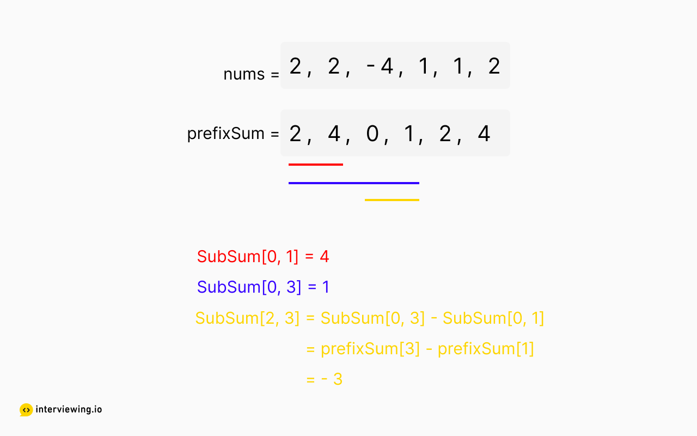

https://interviewing.io/questions/subarray-sum-equals-k

At this point, we have a decent quadratic solution with constant space - but, one common way to continue optimizing runtime is through the introduction of additional data structures and pre-processing, at the expense of additional space complexity. Be sure to mention these tradeoffs with your interviewer!

Recall that we are asked to return the number of subarrays whose sum equals k, not the subarrays themselves. So, do we really need to generate all the subarrays? What we only need to know is how many times the sum k can be created with any possible subarrays - and this can be found with some deductive reasoning and a clever concept called prefix sums.

Firstly, let's generate our subarray sums with the aid of some pre-processing. Create a new array and populate it with the cumulative sums of all the prefixes in nums, where prefixSum[1] == nums[0] + nums[1] and prefixSum[2] == nums[0] + nums[1] + nums[2]. This alone doesn't capture all the subarrays, only those originating with index 0, but we can apply a clever formula to capture the rest.

If we know the sums of two prefixes, the sum of the subarray between the two prefixes is the difference between the prefix sums. Let's use this notation to indicate the sum of a subarray from index i to j - SubSum[i, j] - and look at an example:

sub_array_sum_equals_k_1-1.png

To find the sum of the subarray from index 2 to 3, we can subtract prefixSum[1] from prefixSum[3].

With this prefix array, we can use our same nested for-loop to consider each subarray and get it's sum in constant time; but, this still keeps us to a quadratic runtime.

How can we optimize even further? We would have to limit the algorithm to a single nested loop. We know we can generate the prefix sums with a linear scan, as well as use the formula to find certain subarray sums. Let's apply another clever strategy: if SubSum[0, 3] = 1 and k = -3, and if we have seen a subarray with the sum 1 - k, then we know that SubSum[0, 3] is part of a subarray whose sum is k. Which is the only thing we're actually looking to know!

Instead of generating the entire prefix array, we iterate through nums while keeping a running sum and track how many times we've seen each prefix sum with a frequency hash. At each iteration, deduce if our target sum (runningSum - k) has been seen before - if so, increment a global count - and then update the frequency hash. Finally, return the count.

Why do we initialize the hash with {0:1}? Well, this handles the edge case when targetSum is 0, since this sum does in a sense exist - following the above logic, the number of subarrays with sum 0 is 1, as this is the empty subarray, no elements.

https://github.com/eMahtab/subarray-sum-equals-k/blob/master/README.md
# Subarray Sum Equals k
## https://leetcode.com/problems/subarray-sum-equals-k

Given an array of integers and an integer k, you need to find the total number of continuous subarrays whose sum equals to k.

Example 1:
Input:nums = [1,1,1], k = 2
Output: 2

**Note:**
1. The length of the array is in range [1, 20,000].
2. The range of numbers in the array is [-1000, 1000] and the range of the integer k is [-1e7, 1e7].


# Implementation 1 : Check all possible continuous subarrays
```java
public class Solution {
    public int subarraySum(int[] nums, int k) {
        int count = 0;
        for (int start = 0; start < nums.length; start++) {
            int sum=0;
            for (int end = start; end < nums.length; end++) {
                sum+=nums[end];
                if (sum == k)
                    count++;
            }
        }
        return count;
    }
}
```

#### Complexity Analysis :

###### Time complexity : O(n^2)
We need to consider every subarray possible.

###### Space complexity : O(1)
Constant space is used.

# Implementation 2 : Even Better
### Approach :
Say you are given an array e.g. [a0, a1, a2, a3, a4, a5, a6... an] .
```
[a0, a1, a2, a3, a4, a5, a6... an]
	 ^	     ^	
	sumI	    sumJ
sumI = sum of numbers till a2 (a0 + a1 + a2)
sumJ = sum of numbers till a5 (a0 + a1 + a2 + a3 + a4 + a5)
```

Now lets say the difference between sumJ and sumI is equal to k.
What that means is, the sum of numbers between a2 and a5 is equal to k ( `a3 + a4 + a5 = k` ), which means we found a subarray whose sum is equal to k.

We can write `a3 + a4 + a5 = k` as `sumJ - sumI = k` and `sumJ - sumI = k` can be written as `sumJ - k = sumI`

The expression `sumJ - k = sumI`, means have we already seen a sum which is equal to sum at current index j minus k. If yes, it means we found a subarray whose sum is equal to k.

And we keep track of how many times we see a particular sum using a HashMap.

```java
class Solution {
    public int subarraySum(int[] nums, int k) {
        if(nums == null || nums.length == 0)
            return 0;
        int count = 0;
        Map<Integer, Integer> map = new HashMap<>();
        map.put(0, 1);
        int sum = 0;
        for(int i = 0; i < nums.length; i++) {
            sum += nums[i];
	    // the reason we are checking in the map whether it contains sum - k, because it means there is a subarray with sum k  
            if(map.containsKey(sum - k)) 
                count += map.get(sum-k); // watch out : count++; will not give correct result
            map.put(sum, map.getOrDefault(sum,0) + 1);
        }
        return count;
    }
}
```

```
e.g.
int[] nums = [3, 4, 1, 6, -4, -3, 5, 2], k = 7
The answer will be 6

[3, 4]
[1, 6]
[4, 1, 6, -4]
[3, 4, 1, 6, -4, -3]
[1, 6, -4, -3, 5, 2]
[5, 2]

```

##### Complexity Analysis :

###### Time complexity : O(n)
The entire nums array is traversed only once.

###### Space complexity : O(n)
Hashmap map can contain up to n distinct entries in the worst case.

# References :
https://leetcode.com/articles/subarray-sum-equals-k